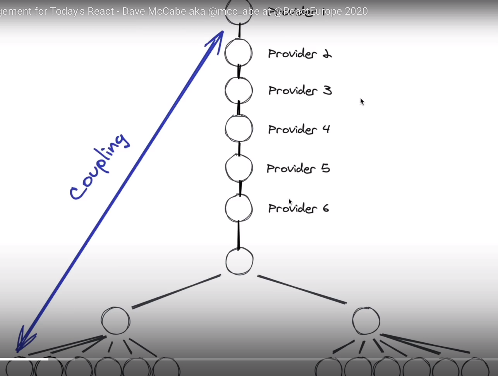

# create-react-app

create-react-app으로 reat 초기 환경을 만들게 되면 여러 파일들이 자동으로 생성되게 됩니다.
하지만 우리는 App.js, index.js만 필요하기때문에 해당 파일을 제외한 모든 파일을 제거해줌으로 초기 환경을 구축합니다.

이 레포지토리 안에는 react 공부를 하면서 학습한 내용들을 정리하는 react 학습지가 될 것 입니다.

# 사전 필요한 요소들 설치 방법

## styled-componets 적용하는 방법
```npm i styled-components```
## TypeScript 적용하는 방법
처음 시작할 때:
```npx create-react-app 앱이름 --template typescript```

or 

중간에 추가할 때(하나씩 다 추가해줘야함):
`npm install --save typescript @types/node @types/react @types/react-dom @types/jest`

react에선 파일명이 `.js`가 아닌 `.tsx`로 사용된다

## 파일 관리
`routes` : 사용할 페이지들을 이 폴더에 관리합니다.
`components` : 페이지들에 사용되는 컴포넌트를 이 폴더에 관리합니다.
`styled.d.ts` : theme객체에 적용될 타입을 지정합니다.
`Router.tsx` : `react-router-dom`을 사용해서 라우팅 처리하는 파일입니다. 

## 라이트모드/다크모드

단순 한가지 모드만 지원하면 그냥 `index.tsx`에서 `ThemeProvider`랑 `theme`선언해서 전체 애플리케이션에 해당 색상코드를 적용할 수 있지만, 두 가지 모드를 지원하기 위해서는 `theme`을 변경할 수 있어야해. 즉 상태관리가 필요하다는 것.


`useState`를 사용하기 위해서 옮기는 것 이야. 하지만 `useState` 훅을 사용해서 상태를 관리하면 여러 컴포넌트에서 해당 상태를 사용하기 위해 `모오오오두` 연결되어야 해. 때문에 사용하지도 않는 컴포넌트가 자신의 자식 컴포넌트의 요청으로 인해 필요없는 렌더링이 진행될 수 있어. 또한 useState를 prop으로 전달하려면 `단방향`만 가능하지만 상태관리 라이브러리를 사용하면 `양방향`으로 전달이 가능하다. => `Redux/Recoil 등..`의 사용

`react-query`는 API를 통해 서버의 상태 관리를 하는 건데 theme을 만지는건 굳이 비싼 네트워크통신이 필요 없어보임. 때문에 react-query를 쓰지 않는건가??

## Recoil을 사용하기

```
npm i recoil
```
recoil을 설치한 뒤 전역적으로 사용하기 위해 Provider를 index.tsx에 선언해줘야 선언한 모든 Atom들을 사용할 수 있다고 해.
그리고 Atoms.ts에서 선언한 atom들을 `필요할때마다` 불러와서 사용하면 끝!. `so easy~!!`
```javascript
const isDark = useRecoilValue(설정한 atom이름);
const setterFn = useSetRecoilState(설정한 atom이름);

==========OR=============
const [x, setX] = useRecoilState(설정한 atom이름); // useState()처럼 사용할 수 있어.
```
`setterFn`은 useState()함수처럼 현재 값을 인자로 받을 수 있어.