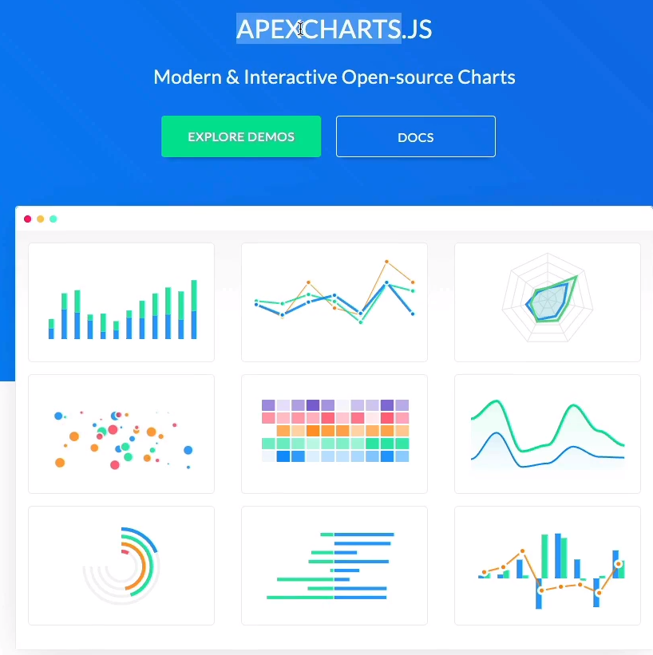

1. theme에 적용할 스타일을 선언해준다.
2. styled.d.ts에 theme에 선언한 색상 객체의 타입을 styled-componets의 모듈로 선언해서 타입을 선언해준다.
3. react-router-dom과 react-query를 설치해준다.

4. 보여줄 화면들은 `routes폴더`안에다가 모아둡니다. 

# react-router-dom V6
5. 라우팅 처리를 해 주기 위해 react-router-dom을 설치합니다.
    - react-router-dom V6에서는 더이상 switch를 사용하지 않고 routes로 더욱 직관적으로 바뀌었습니다.
    - `<Route>` 처리는 비슷한데 더이상 `render/exact/component`를 쓰지 않는다고 합니다.
    - 대신 element로 컴포넌트를 받아옵니다. 
    - 여러 라우팅을 매칭하고 싶은 경우 URL 뒤에 `*`를 사용합니다.

    - 추가적으로 `nested routes`를 표현하기 위해서는 부모 라우터에 새로운 라우트가 올 수 있다는것을 명시해줘야합니다.
    ```
    <Route path="/:coinId/*>" element={<Coin/>} />
    ```
    - 이처럼 부모 요소에 여러 라우팅을 매칭하고 싶다는 `"*"`를 붙여줍니다!
    -  ✅`nested routes`를 표현할 때 정확한 path를 확인하고 싶으면 `useLocation()`대신 `useMatch()`훅을 사용해야 합니다.
    - 해당 훅은 맞으면 `객체를`, 틀리면 `null을` 반환합니다. 

6. react-router-dom을 사용해서 라우팅 처리를 하기 위해서는 우선 `router context`를 제공해야합니다.
`router context`는 `<BrowserRouter>`라는 컴포넌트로 모든 `<App>`을 감쌈으로써 제공할 수 있다고 합니다.

# styled-components 전역 스타일링 -> for Reset CSS
전역으로 모든 styled-components들의 컴포넌트들에 Reset CSS를 적용하려면 어떻게 해야 할까?
우선 Reset CSS라는 라이브러리를 다운받는 방법이 있다. 하지만 굳이 Reset CSS를 적용하기 위해 라이브러리를 설치하는 것은 낭비라고 생각한다. 때문에 styled-components에서 제공하는 createGlobalStyle이라는 기능을 사용해서 적용해보도록 하자

✅ 추가로 styled-components로 만든 컴포넌트에 prop을 넘겨줄 수 있습니다. 
```
styled.span<{ isActive: boolean }>
```
위처럼 isActive라는 prop을 전달하는데 ts이기때문에 타입은 boolean입니다.

## createGlobalStyle이란?
이건 하나의 컴포넌트를 만들 수 있게 해주는데, 렌더링 될 때, 이 컴포넌트는 전역 스코프에 스타일들을 올려주게 된다고 해. 따라서 Reset CSS같은 전역으로 적용될것은 이걸로 해결할 수 있겠습니다.

이 컴포넌트로 어떤 컴포넌트를 감쌀 필요가 없고 `그냥 선언만 해주면 되는것`

# useEffect에 async/await 적용하기
기본적으로 useEffect에는 async/await를 적용할 수 없다. 때문에 안에 새로운 함수를 만들고 그 함수를 호출하는 식으로 사용했었는데,
`즉시 실행함수`로 새로운 함수를 만드는것도 가능하다고 한다. 특이한 기술을 배웠다. 👍👍

# 중요!! ✅Link 컴포넌트에 대해 알아보았다.
Link에서 이제 state를 넘겨줄 때, to로 한번에 넘기지 않고 state는 state라는 prop을 사용합니다.
Link에는 더이상 제네릭을 지원하지 않기때문에 ts를 지정하기 위해서는
`useLocation()` Hook을 사용해서 Link로 넘겨지는 `state`를 가져올 수 있습니다.
```
const location = useLocation();
const state = location.state as RouterState; // RouterState는 state의 interface
```
위처럼 접근해야 합니다.

그리고 정직하게 Link를 타고 넘어오면 state가 넘겨져서 state값이 보이지만 `Direct`로 접근하면 state가 만들어지지 않아서 다시 호출해야 합니다.

# React Query❤️❤️❤️
React Query를 사용하면 우리가 사용했던 `useState`나 `useEffect`같은 Hook들을 사용하지 않아도 된다고 합니다.
```
npm i react-query
```
react-query를 설치해준다.

```
const queryClient = new QueryClient();

<QueryClientProvier client={queryClient}>
 ...
</QueryClientProvier>
```
queryClient를 만들어주고 provider를 만들어주어서 사용한다고 하빈다.
이 모습은 `createContext`이나 styled-components의 라이트모드/다크모드 적용하던 `ThemeProvider`에서 본 모습이랑 유사합니다.
`ThemeProvider`랑 마찬가지로 해당 컴포넌트 안에 포함된 모든 컴포넌트는 모두 Provider에 접근할 수 있음을 명시합니다. 

`createContext`는 상태관리를 할 때 봤습니다. 마찬가지로 react query를 사용하면 `서버의` 상태관리를 할 수 있다고 합니다.
덕분에 fetching, caching, synchronizing, updating할 수 있도록 도와줍니다.

사용방법은 매우 간단하더군요.
1. 서버의 자원을 `fetching`하는 곳에 `useQuery`라는 Hook을 사용합니다.
2. `useQuery`안에는 2가지 인자를 받는데, 첫 번째 인자로는 서버의 상태를 캐싱하는데 캐싱한 객체의 키값으로 `Query key`를 사용한다고 합니다.
2-1. 두 번째 인자로는 서버의 상태를 받아오는 `fetcher함수`를 인자로 받습니다. 따라서 우리는 함수를 `api.ts`라는 파일에 따로 관리해서 재사용성을 높여줄 수 있습니다.
3. useQuery의 `반환값`으로는 객체가 반환되는데 여기서 `isLoading`이라는 프로퍼티에선 서버의 응답이 완료되었는지 Promise의 상태가 나타나고, `data`라는 프로퍼티에선 응답한 데이터가 저장된다고 합니다. 
4. 2에서 봤듯이 useQuery를 사용하면 서버의 상태를 캐싱한다고 했는데 이 덕분에 우리는 다른 라우터로 이동했다가 다시 처음 페이지로 돌아와도 페이지가 재렌더링 되지 않습니다. `so cool!!👍👍`

5.✔️ 한 개의 useQuery를 사용할때는 괜찮은데 여러개의 useQuery를 사용하면 `반환값의 프로퍼티가 동일하다는 문제` 하나와 `유니크한 키값을 설정하는 문제` 하나가 생깁니다. 때문에 우린 첫번째 문제를 객체에 다른 이름을 줌으로써 해결을 하고, 두번째 문제는 `key`값은 애초에 배열화로 된다는 사실을 바탕으로 `배열`로 유니크한 값을 넣어줌으로써 해결합니다. 마지막 세번째는 서버에서 데이터를 받아오는 `주기`를 설정해줄 수 있습니다. 때문에 사용자는 매번 최신의 데이터를 확인할 수 있죠. 
```
{ refetchInterval: 5000 } // 이처럼 사용하면 된다고 합니다.
```
5-1. react-query를 사용할 때 `App.tsx`에서 `<ReactQueryDevtools initialIsOpen={true}/>`를 사용해주면 캐싱된 `state`값을 한눈에 확인할 수 있습니다!!

# apexcharts.js 그래프 그리기 라이브러리


# React Helmemt
이건 `컴포넌트`인데 여기서 무엇을 render하던 그게 문서의 head로 가는것이라고 해.
즉, 문서의 head로의 direct link가 적용된다고 합니다.
때문에 css나 favicon같은 것들도 컴포넌트단에서 동적으로 적용할 수 있도록 도와줍니다.


# Refactoring

1. Home화면을 만들어보자
- Home화면에서는 Crypto Tracker라는 제목을 애니메이션으로 재밌게 줘 본다.
- Helmet을 사용해서 doc의 head-title에 접근한다

2. 공통부분인 사이드 바 부분은 Routes로 처리하기 전에 선언하면 전역으로 사용된다.
    - Router에서 공통 부분은 미리 처리하고, 바뀌는 부분만 Routes로 다른 라우팅 처리를 한다.